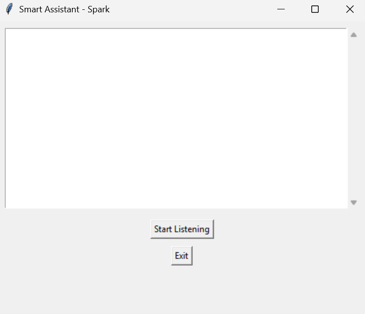

# SmartAI Assistant - "Spark"
A voice-controlled smart assistant built with Python. 
**Spark** can tell jokes, fetch weather, set alarms & reminders, give you Wikipedia summaries, and more — all through a simple GUI.

# Features
  >> Voice Recognition(Speech to text)
  >> Get current time
  >> Tell jokes using pyjokes
  >> Weather Forecast using OpenWeatherMap API
  >> Wikipedia summaries
  >> Set alarms and timers
  >> Smart reminders
  >> User-friendly Tkinter GUI

# Project Structure
  SmartAIassistant/-
  |
  |--gui_assistant.py
  |--core.py
  |--utils.py
  |--alaram_features.py
  |--reminder_manager.py
  |--weather.py
  |-- .gitignore
  |-- .env

# Requirements
 >> python 3.10+
 >> speechrecogintion
 >> pyttsx3
 >> pyjokes
 >> wikipedia
 >> requests
 >> python-dotenv
 >>  tkinter(comes preinstalled with python)

## Security Note
  Make sure your `.env` file is **Not uploaded** to GitHub.
  It's already ignored using `.gitignore`, so your API keys remain safe.

## Screenshot
  Here's a preview of the assistant GUI:
  

## Author
  *Narasimha Jaladurgam*
  [GitHub Profile](https://github.com/Narasimha-66)

  
  [LinkedIn Profile](https://www.linkedin.com/in/narasimha-jaladurgam-90266624b/)

## Show some Love
 If you like this project, don't forgrt to ⭐ the repo and share feedback.

